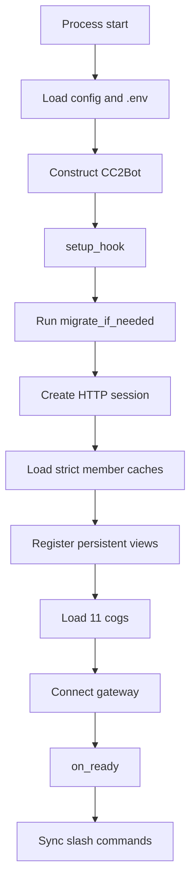
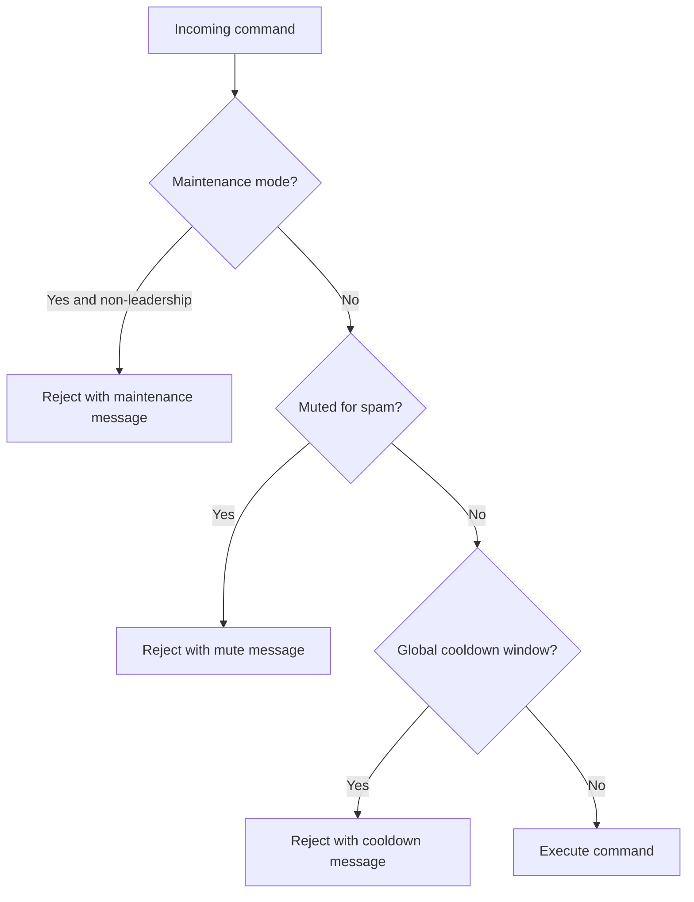
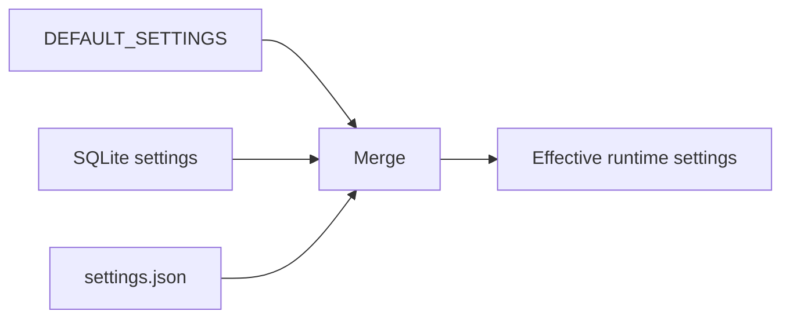

# CC2 Academy Discord Bot Documentation

Version: 4.2
Date: 2026-03-24
Status: Active codebase reference (code-aligned)

Last Updated: Cleanup phase — removed 10 unused endpoint commands, kept 3 (rankings, labels, locations) (Mar 24, 2026)
Command count regenerated: 78 total entries

Source of truth:
- If this document differs from code, code is authoritative.

## Table of Contents
- [Overview](#overview)
- [Known Limitations and Caveats](#known-limitations-and-caveats)
- [Architecture](#architecture)
- [Startup and Runtime Flows](#startup-and-runtime-flows)
- [Command Inventory](#command-inventory)
- [Command Usage Examples](#command-usage-examples)
- [Embed Reference](#embed-reference)
- [Background Schedulers and Trackers](#background-schedulers-and-trackers)
- [Persistence and Data Model](#persistence-and-data-model)
- [Runtime Configuration](#runtime-configuration)
- [Environment Variables](#environment-variables)
- [Security and Reliability Controls](#security-and-reliability-controls)
- [Testing and QA](#testing-and-qa)
- [Operations Runbook](#operations-runbook)
- [File Map](#file-map)
- [Documentation Maintenance](#documentation-maintenance)

## Overview

CC2 Academy Discord Bot is a Clash of Clans operations bot for Discord communities.
It provides:
- Player profile intelligence and rush scoring
- War readiness and war event visibility
- Raid readiness and raid performance tracking
- Donation analytics and monthly snapshots
- Achievement and challenge automation
- Multi-guild scoped operations
- Leadership-focused controls for moderation, maintenance, and clan operations

Design principles:
- Modular cogs, not a monolith
- Hybrid command UX where useful
- DB-first persistence with JSON compatibility fallback
- Automated background loops for recurring operational checks

## Known Limitations and Caveats

- Prefix commands require Message Content intent enabled for the bot application.
- Some command outputs depend on external Clash API availability and response health.
- Manual and automated setting writes can diverge if edited from multiple places simultaneously.
- Legacy JSON compatibility paths intentionally remain and add storage complexity.
- Some historical notes may still refer to older upgradecheck behavior; use this document and active cogs as the current reference.
- Bot-to-bot command triggering is often blocked by target bot logic; use manual-assisted QA mode for end-to-end verification.

## Architecture

### Core Runtime
- Entry file: `discordwelcomebot.py`
- Bot class: `CC2Bot`
- Prefix: `cc2 ` (case-insensitive)
- Mention prefix: supported

### Loaded Cogs (11)
- `cogs.profiles`
- `cogs.membership`
- `cogs.war`
- `cogs.raids`
- `cogs.leaderboards`
- `cogs.achievements`
- `cogs.challenges`
- `cogs.donations_cog`
- `cogs.upgrades`
- `cogs.runtime_config`
- `cogs.admin`

### Persistent UI Views
- `PlayerProfileView`
- `JoinEmbedView`

### Key Shared Runtime State
- `aiohttp` HTTP session for CoC API
- CoC concurrency semaphore
- Global clan list and guild-scoped clan resolution
- Strict membership baseline caches
- Command usage analytics and anti-spam state
- Maintenance mode state and message

## Startup and Runtime Flows

### Startup Sequence



### Command Guard Flow



### Settings Merge Rule



Priority order:
1. Defaults
2. SQLite values
3. File values (`settings.json`)

## Command Inventory

Columns:
- Name: command name
- Aliases: comma-separated aliases
- Type: `Hybrid`, `Slash-only`, `Text-only`, `Hybrid Group`, `Group Subcommand`
- Access: `Everyone`, `Leadership`, `Admin`
- Cog: source cog file

<!-- COMMAND_INVENTORY_START -->

Generated from decorators in `cogs/*.py`. Total entries: **78**.

| Name | Aliases | Type | Access | Cog |
|---|---|---|---|---|
| achievements | ach | Hybrid | Everyone | achievements |
| addachievement | addach | Hybrid | Leadership | achievements |
| milestone | ms | Hybrid | Everyone | achievements |
| scanachievements | scanach | Hybrid | Leadership | achievements |
| addattack | aatk | Hybrid | Everyone | admin |
| addbase | ab | Hybrid | Everyone | admin |
| addclan | - | Slash-only | Everyone | admin |
| basebook | - | Slash-only | Everyone | admin |
| botstats | bs | Hybrid | Everyone | admin |
| calculate | calc | Hybrid | Everyone | admin |
| clan | cl | Hybrid | Everyone | admin |
| clanhealth | chl | Hybrid | Everyone | admin |
| cleanup | - | Slash-only | Everyone | admin |
| clear | cg | Hybrid | Admin | admin |
| clearbot | cb | Hybrid | Admin | admin |
| clearcache | - | Slash-only | Everyone | admin |
| createevent | ce | Hybrid | Admin | admin |
| familyreport | fr | Hybrid | Leadership | admin |
| fetchattack | fatk | Hybrid | Everyone | admin |
| fetchbase | fb | Hybrid | Everyone | admin |
| findplayer | fp | Hybrid | Leadership | admin |
| getbase | - | Slash-only | Everyone | admin |
| help | h | Hybrid | Everyone | admin |
| inactive | ia | Hybrid | Leadership | admin |
| kicksuggestions | ks | Hybrid | Leadership | admin |
| link | ln | Hybrid | Everyone | admin |
| maintenance | maint | Hybrid | Leadership | admin |
| maintstatus | mstat | Hybrid | Leadership | admin |
| onboardingdm | odm | Hybrid | Leadership | admin |
| poll | pl | Hybrid | Leadership | admin |
| promotionsuggestions | ps | Hybrid | Leadership | admin |
| remind | rm | Hybrid | Everyone | admin |
| removeclan | - | Slash-only | Everyone | admin |
| restart | reboot | Hybrid | Leadership | admin |
| roster | ros | Hybrid | Everyone | admin |
| setbase | - | Slash-only | Everyone | admin |
| setmain | mainacc | Hybrid | Everyone | admin |
| status | st | Hybrid | Everyone | admin |
| syncroles | - | Slash-only | Everyone | admin |
| test-join | testjoin, tj | Text-only | Everyone | admin |
| transferlog | tlog | Hybrid | Leadership | admin |
| unlink | unln | Text-only | Everyone | admin |
| welcome | wel | Hybrid | Leadership | admin |
| whois | wi | Text-only | Everyone | admin |
| challenge | ch | Hybrid | Everyone | challenges |
| donationhistory | dh | Hybrid | Everyone | donations_cog |
| donations | don | Hybrid | Everyone | donations_cog |
| takesnapshot | ts | Hybrid | Leadership | donations_cog |
| myrank | mr | Hybrid | Everyone | leaderboards |
| top | lb | Hybrid | Everyone | leaderboards |
| compare | cmp | Hybrid | Everyone | profiles |
| info | i | Hybrid | Everyone | profiles |
| p | - | Text-only | Everyone | profiles |
| profile | pf | Hybrid | Everyone | profiles |
| rushhistory | rhs | Hybrid | Everyone | profiles |
| upgradepriority | upg | Hybrid | Everyone | profiles |
| capitalleagues | cpleagues | Hybrid | Everyone | raids |
| capitalrank | cprank | Hybrid | Everyone | raids |
| capitalstatus | cps, capital | Hybrid | Everyone | raids |
| raidhistory | rh | Hybrid | Everyone | raids |
| raidreminder | rr | Hybrid | Everyone | raids |
| raidreport | rrpt | Hybrid | Everyone | raids |
| raidsleft | rl | Hybrid | Everyone | raids |
| raidstatus | rs | Hybrid | Everyone | raids |
| raidtrends | rt | Hybrid | Everyone | raids |
| config | cfg | Hybrid Group | Everyone | runtime_config |
| get | cget | Group Subcommand | Everyone | runtime_config |
| set | cset | Group Subcommand | Everyone | runtime_config |
| upgradecheck | uc | Hybrid | Everyone | upgrades |
| attacklog | atklog | Hybrid | Everyone | war |
| cwlgroup | cwl | Hybrid | Everyone | war |
| cwlround | cwlr | Hybrid | Everyone | war |
| labels | lbl | Hybrid | Everyone | war |
| locations | loc | Hybrid | Everyone | war |
| misstreak | ms2 | Hybrid | Leadership | war |
| opponentlineup | ol | Hybrid | Everyone | war |
| rankings | rank | Hybrid | Everyone | war |
| warhistory | wh | Hybrid | Everyone | war |
| warmap | wm | Hybrid | Everyone | war |
| warperformance | wp | Hybrid | Everyone | war |
| warpreview | wpv | Hybrid | Everyone | war |
| warrating | wrate | Hybrid | Leadership | war |
| warreminder | wr | Hybrid | Everyone | war |
| wartrends | wt | Hybrid | Everyone | war |
| whohavenotattacked | wna | Hybrid | Everyone | war |

<!-- COMMAND_INVENTORY_END -->

### Command Count Summary
- Inventory table is auto-generated from decorators in active `cogs/*.py`.
- Includes group parent and subcommands as separate entries.

## Command Usage Examples

### Reference and Discovery (New in Mar 24, 2026)
- Rankings by location:
  - `cc2 rankings clan US`
  - `cc2 rankings player 32000042` (location ID)
- Available labels:
  - `cc2 labels clan`
  - `cc2 labels player`
- Locations list with search:
  - `cc2 locations`
  - `cc2 locations United States`
- League references:
  - `cc2 leagues` (home village league catalog)
  - `cc2 league 29000001` (league details)
  - `cc2 warleagues` (CWL league list)
  - `cc2 warleague 48000000` (CWL league details)
  - `cc2 builderbaseleagues` (builder base league catalog)
  - `cc2 builderbaseleague 29000000` (builder base league details)
  - `cc2 leagueseasons 29000001` (seasons for a league)
  - `cc2 leagueseason 29000001 2026032` (specific season details)
- Builder base rankings:
  - `cc2 bbclanrank US` (builder base clan trophies by location)
  - `cc2 bbplayerrank 32000042` (builder base player trophies by location)

### General User Queries
- Profile details:
  - `cc2 info #TAG`
  - `/info tag:#TAG`
- Compare players:
  - `cc2 compare #TAG1 #TAG2`
  - Output includes decision summary + role-based best-fit recommendations (war attacker, support donor, trophy push).
- Weekly challenge:
  - `cc2 challenge`
  - Output now includes status, remaining target, pace-needed guidance, and actionable next steps.
- Milestone progress:
  - `cc2 milestone #TAG`
  - Output now includes tier progress bars, next target gap, and milestone completion count.
- Rush trend review:
  - `cc2 rushhistory #TAG 10`
  - Output now includes status band, trend outlook, average step change, and recommended next step.
- Leaderboards:
  - `cc2 top donations`
  - `cc2 myrank trophies`
- Clan snapshot:
  - `cc2 clanhealth`

### War and Raid
- Pending war attacks:
  - `cc2 whohavenotattacked`
  - Output now includes urgency band and suggested leadership action per clan.
- War map:
  - `cc2 warmap`
  - Output now includes pressure band and tactical next-step guidance.
- War trend analytics:
  - `cc2 wartrends 20`
- War history momentum:
  - `cc2 warhistory 10`
  - Output now includes momentum band and recommended leadership action.
- War performance coaching:
  - `cc2 warperformance #TAG`
  - Output now includes performance band and coaching next-step guidance.
- Consecutive miss report (leadership):
  - `cc2 misstreak 2`
- Per-player attack history:
  - `cc2 attacklog #TAG 10`
- Rate latest completed war (leadership):
  - `cc2 warrating win great execution this war`
- Pre-war scouting summary:
  - `cc2 warpreview`
  - Output now includes pressure classification and tactical plan recommendations.
- Opponent lineup detail:
  - `cc2 opponentlineup`
  - Output now includes lineup read (top-heavy/balanced) and opening-plan guidance.
- Raid status:
  - `cc2 raidstatus`
  - Output now includes urgency band and suggested next action based on attack utilization.
- Post-weekend raid summary:
  - `cc2 raidreport`
- Raid trends:
  - `cc2 raidtrends`

### Leadership and Admin
- Upgrade check across monitored clans:
  - `cc2 upgradecheck 1 ALL`
- Inactivity report:
  - `cc2 inactive 7`
  - Output now includes risk tiers (watch/high/critical) and recommended leadership action.
- Promotion suggestions:
  - `cc2 promotionsuggestions #CLAN_TAG`
  - Output now includes confidence buckets (promote/review/coach) and per-candidate action hints.
- Maintenance mode:
  - `cc2 maintenance on scheduled update`
- Manual welcome re-fire:
  - `cc2 welcome #TAG`
- Manual onboarding DM send:
  - `cc2 onboardingdm @member true`
- Auto onboarding DM toggle:
  - `cc2 config set onboarding_dm_enabled true guild`
- Transfer timeline (leadership):
  - `cc2 transferlog 15 guild`
- Runtime config:
  - `cc2 config set announce_channel_id 123456789012345678 guild`
- Cache clear (slash-only):
  - `/clearcache`

### Base and Strategy Workflows
- Save base:
  - `cc2 addbase war https://link.clashofclans.com/... BaseName`
- Fetch base:
  - `cc2 fetchbase 16 hv`
- Save strategy:
  - `cc2 addattack 16 hv "QC Lalo" "funnel, send lalo from 3 o'clock"`
- Fetch strategy:
  - `cc2 fetchattack 16 hv`

## Embed Reference

Canonical reusable embed builders live in `embeds.py`.
The snippets below are code-level references for each active reusable embed.

### 1) Join Embed Router (`build_join_embed`)

```python
def build_join_embed(
    player_json: Dict[str, Any],
    tag: str,
    clan_name: Optional[str] = None,
    member_count: Optional[int] = None,
    member_cap: int = 50,
    layout: str = "compact",
) -> discord.Embed:
    if layout.lower() == "detailed":
        return _build_join_embed_detailed(player_json, tag, clan_name, member_count=member_count, member_cap=member_cap)
    return _build_join_embed_compact(player_json, tag, clan_name, member_count=member_count, member_cap=member_cap)
```

### 2) Join Embed (Compact) (`_build_join_embed_compact`)

```python
embed = discord.Embed(
    title=f"🟢 PLAYER JOINED — {name} ({tag_display})",
    description=(
        f"TH **{format_value(th)}** · XP **{format_value(xp)}** · 🏆 **{format_value(trophies)}** · ⚔️ **{format_value(war_stars)}** wars"
    ),
    color=embed_color,
    timestamp=datetime.now(timezone.utc)
)

embed.add_field(name="🏰 CLAN", value="\n".join(clan_lines), inline=False)
embed.add_field(name="`─────────────────`", value="", inline=False)
embed.add_field(
    name="📊 STATS",
    value=(
        f"Donations: **{format_value(donations)}** | Received: **{format_value(received)}**\n"
        f"Attacks: **{format_value(attack_wins)}** | Defense: **{format_value(defense_wins)}**"
    ),
    inline=False
)
embed.add_field(name="`─────────────────`", value="", inline=False)
embed.add_field(name="HEROES", value=hero_block, inline=False)
embed.add_field(name="`─────────────────`", value="", inline=False)
embed.add_field(
    name="🧩 ARMY",
    value=(
        f"⚔️ Troops: **{format_value(troop_count)}** | 🔝 Maxed: **{format_value(maxed)}**\n"
        f"✨ Spells: **{format_value(spell_count)}** | 🐾 Pets: **{format_value(pet_count)}**"
    ),
    inline=False
)
embed.set_footer(text=f"CC2 Clash Bot — Player Joined • {tag_display}")
```

### 3) Join Embed (Detailed) (`_build_join_embed_detailed`)

```python
embed = discord.Embed(
    title=f"🟢 PLAYER JOINED — {name} ({tag_display})",
    description=(
        f"TH **{format_value(th)}** · XP **{format_value(xp)}** · "
        f"🏆 **{format_value(trophies)}** · 🥇 **{format_value(best_trophies)}** · "
        f"⚔️ **{format_value(war_stars)}** wars"
    ),
    color=embed_color,
    timestamp=datetime.now(timezone.utc)
)

embed.add_field(name="📊 SEASON STATS", value=season_stats, inline=False)
embed.add_field(name="🏆 LIFETIME STATS", value=lifetime_stats, inline=False)
embed.add_field(name="💰 TOTAL LOOT (LIFETIME)", value=loot_stats, inline=False)
embed.add_field(name="🦸 HEROES", value=hero_block, inline=False)
embed.add_field(name="🧩 ARMY", value=army_stats, inline=False)
embed.add_field(name="RUSH STATUS", value=rush_lines, inline=False)
embed.set_footer(text=f"CC2 Clash Bot — Player Joined • {tag_display}")
```

### 4) Profile Embed (Compact) (`build_profile_embed_compact`)

```python
embed = discord.Embed(
    title=f"{name}  {tag_display}",
    description=(
        f"TH **{format_value(th)}** · XP **{format_value(xp)}** · 🏆 **{format_value(trophies)}**"
    ),
    color=embed_color
)

embed.add_field(name="📊 ESSENTIALS", value=essentials_value, inline=False)
embed.add_field(name="⚔️ STATS", value=stats_value, inline=False)
embed.add_field(name="🦸 HEROES", value=hero_block, inline=False)
embed.add_field(name="RUSH STATUS", value=rush_val, inline=False)
embed.add_field(name="🎮 DISCORD", value=linked_user, inline=False)
embed.set_footer(text=f"CC2 Clash Bot • Profile (Compact) • {tag_display}")
```

### 5) Profile Embed (Detailed) (`build_profile_embed_detailed`)

```python
embed = discord.Embed(
    title=f"{name}  {tag_display}",
    description=(
        f"XP **{format_value(xp)}** · "
        f"TH **{format_value(th)}** · "
        f"🏆 **{format_value(trophies)}** · "
        f"🥇 **{format_value(best_trophies)}** · "
        f"⚔️ Wars **{format_value(wars_played)}**"
    ),
    color=embed_color
)

embed.add_field(name="🏆 CORE STATS", value=core_stats_value, inline=False)
embed.add_field(name="📊 SEASON STATS", value=season_stats_value, inline=False)
embed.add_field(name="🏰 CLAN INFO", value=clan_info_value, inline=False)
embed.add_field(name="🏆 LIFETIME STATS", value=lifetime_stats_value, inline=False)
embed.add_field(name="💰 TOTAL LOOT (LIFETIME)", value=total_loot_value, inline=False)
embed.add_field(name="🦸 HEROES", value=hero_block.rstrip(), inline=False)
embed.add_field(name="⚡ RUSH STATUS", value=rush_val, inline=False)
embed.add_field(name="🎮 DISCORD", value=linked_user, inline=False)
embed.set_footer(text=f"CC2 Clash Bot • Profile (Detailed) • {tag_display}")
```

### 6) Info Wrapper (`build_info_embed`)

```python
def build_info_embed(
    player: Dict[str, Any],
    tag: str,
    layout: str = "compact",
    streaks: Optional[Dict[str, Any]] = None,
) -> discord.Embed:
    if layout.lower() == "detailed":
        return build_profile_embed_detailed(player, tag, streaks=streaks)
    else:
        return build_profile_embed_compact(player, tag)
```

### 7) Leave Embed (`build_leave_embed`)

```python
embed = discord.Embed(
    title=f"{name or 'Player'}  {tag_display}",
    description="Player has left the clan.",
    color=discord.Color.red(),
    timestamp=datetime.now(timezone.utc)
)
embed.add_field(name="Tag", value=f"`{tag_display}`", inline=True)
if member_count is not None:
    embed.add_field(name="Members", value=f"**{format_value(member_count)}/{format_value(member_cap)}**", inline=True)
embed.set_footer(text="CC2 Clash Bot • Player Left")
```

### 8) Donation Embed (`build_donation_embed`)

```python
embed = discord.Embed(
    title=f"{name}  {tag_display}",
    description=f"💝 **{format_value(seasonal)}** sent · **{format_value(received)}** received (this season)",
    color=discord.Color.green(),
    timestamp=datetime.now(timezone.utc)
)

embed.add_field(name="📅 CURRENT SEASON", value=current_season_value, inline=False)
embed.add_field(name="🏆 LIFETIME DONATIONS", value=lifetime_value, inline=False)
embed.set_footer(text="CC2 Clash Bot • Donation Stats")
```

### 9) Compare Embed (`build_compare_embed`)

```python
embed = discord.Embed(
    title="⚖️ Player Comparison",
    color=discord.Color.blurple(),
    timestamp=datetime.now(timezone.utc),
)
embed.description = overall

embed.add_field(name=f"{a_name} `{tag_a}`", value=a_metrics_block, inline=True)
embed.add_field(name=f"{b_name} `{tag_b}`", value=b_metrics_block, inline=True)
embed.add_field(name="Δ (A - B)", value="\n".join(delta_lines), inline=False)
embed.set_footer(text="CC2 Clash Bot • Compare")
```

Notes:
- These are the reusable, shared embed builders from `embeds.py`.
- The bot also creates one-off operational embeds inside cogs (`cogs/admin.py`, `cogs/war.py`, `cogs/raids.py`, etc.) for alerts, prompts, and status.

## Background Schedulers and Trackers

### Decorator-based loops
- Admin:
  - `daily_backup_loop` (hourly check, runs daily near 03:00 UTC)
  - `reminder_dispatch_loop` (every 30s)
  - `weekly_kick_review_loop` (hourly check, weekly digest)
- War:
  - `fixed_time_reminder` (every 30s)
  - `active_war_reminder_loop` (every 30m)
  - `pinned_cleanup_loop` (hourly)
- Raids:
  - `raid_snapshot_loop` (configured interval)
  - `raid_reminder_loop` (configured interval)
- Donations:
  - `monthly_snapshot` (hourly loop)
- Achievements:
  - `achievement_scan_loop` (every 12h)
- Challenges:
  - `challenge_loop` (every 30m)

### Per-clan async trackers (task-created, non-decorator)
- Membership tracker loop per clan
- Upgrades tracker loops per clan
- War tracker loop per clan

## Persistence and Data Model

### Storage Strategy
- Hybrid model: JSON compatibility + SQLite persistence
- DB-first reads for implemented entities with JSON fallback where needed
- Atomic JSON writes via temp-file replace

### Primary JSON datasets
- `settings.json`
- `clans.json`
- `links.json`
- `bases.json`
- `attack_strategies.json`
- `member_activity.json`
- `donation_snapshots.json`
- `war_results.json`
- `war_player_stats.json`
- `raid_history.json`
- `monthly_leaderboard.json`
- `capital_progress.json`
- `achievements.json`
- `challenges.json`
- `transfers.json`
- `reminders.json`
- `rush_history_entries.json`
- `members_*.json`
- `war_*.json`

### SQLite schema tables
- `settings`
- `clans`
- `member_activity`
- `json_blobs`
- `rush_history`
- `transfers`
- `leaderboard_snapshots`
- `reminders`

### Important data relationships
- `links.json` maps player tags to Discord users
- `settings.json` stores `primary_tags` and `guild_settings`
- `member_activity` stores `last_seen` and `last_progress_seen`
- `war_player_stats` powers streak and miss metrics
- `donation_snapshots` drives monthly and trend analytics

## Runtime Configuration

Runtime config command group: `config` (`cfg`)

Supported keys:
- `raid_reminder_enabled` (bool)
- `raid_dm_reminder_enabled` (bool)
- `war_reminder_enabled` (bool)
- `onboarding_dm_enabled` (bool)
- `kick_review_day` (int 0..6)
- `monthly_snapshot_day` (int clamped)
- `inactive_days_threshold` (int clamped)
- `announce_channel_id` (channel id)

Scopes:
- `guild`
- `global`
- `effective`

Immediate in-memory runtime update currently applies for:
- `raid_reminder_enabled`
- `war_reminder_enabled`

## Environment Variables

### Credentials
- `DISCORD_TOKEN`
- `COC_API_KEY`

### Channel and role IDs
- `CHANNEL_ID`
- `LOG_CHANNEL_ID`
- `ANNOUNCE_CHANNEL_ID`
- `AUDIT_CHANNEL_ID`
- `BASE_LAYOUT_CHANNEL_ID`
- `ATTACK_STRATEGY_CHANNEL_ID`
- `LEADERSHIP_ROLE_ID`
- `BOT_ADMIN_ROLE_ID`

### Polling and interval controls
- `CHECK_INTERVAL`
- `WAR_POLL_INTERVAL`
- `REMINDER_INTERVAL`
- `UPGRADE_CHECK_INTERVAL`
- `UPGRADE_ALERT_CHECK`
- `MONTHLY_SNAPSHOT_DAY`

### API and cache performance
- `COC_CONCURRENCY`
- `COC_TIMEOUT`
- `PLAYER_CACHE_TTL`
- `CLAN_CACHE_TTL`
- `WAR_CACHE_TTL`

### Scoring and thresholds
- `HERO_RUSH_THRESHOLD`
- `LAB_RUSH_THRESHOLD`
- `BASE_RUSH_THRESHOLD`
- `PET_RUSH_THRESHOLD`
- `WALL_RUSH_THRESHOLD`
- `MIN_DONATION_RATIO`
- `MIN_WAR_STARS`
- `INACTIVE_DAYS_THRESHOLD`

### Storage override
- `BOT_DB_FILE`

## Security and Reliability Controls

### Access and authorization
- Leadership/admin checks on sensitive commands
- Role-based operational restrictions

### Abuse prevention
- Global cooldown
- Per-user spam tracking
- Temporary command mute windows

### Maintenance mode
- Blocks non-leadership execution with custom message

### Data safety and reliability
- Atomic file writes
- Structured logging
- Startup migration safety guards
- Daily backup zip rotation
- Typed error embeds with recovery hints (error codes + next steps)
- Confirmation buttons on destructive moderation commands (`clear`, `clearbot`)

## Testing and QA

### Repository tests
- Pytest suite currently passing in workspace
- Core coverage includes storage, migration, and behavior regressions

### Isolated QA harness
- Lives in separate workspace `Discord bot testing/`
- Runs suite-defined command cycles
- Stores JSON reports for trend analysis
- Supports manual-assisted mode when target bot ignores bot-origin commands

## Operations Runbook

### Start bot
1. Ensure environment variables are populated.
2. Start from bot root with Python.

### Verify healthy startup
- Confirm all 11 cogs loaded
- Confirm slash sync succeeded
- Confirm no fatal migration errors

### Common runtime checks
- `cc2 status`
- `cc2 botstats`
- `cc2 maintstatus`
- `cc2 config` (leadership)

### Backup and restore
- Daily backups generated by loop
- For restore, keep JSON and SQLite snapshot pair consistent to avoid drift

### DNS or network instability
Symptoms:
- Gateway DNS resolve failures with reconnect backoff

Expected behavior:
- Auto reconnect attempts by discord client
- Session recovery when network stabilizes

## File Map

Core:
- `discordwelcomebot.py`
- `config.py`
- `cache.py`
- `storage.py`
- `db.py`
- `migrate_json_to_sqlite.py`

Cogs:
- `cogs/admin.py`
- `cogs/profiles.py`
- `cogs/membership.py`
- `cogs/war.py`
- `cogs/raids.py`
- `cogs/donations_cog.py`
- `cogs/leaderboards.py`
- `cogs/achievements.py`
- `cogs/challenges.py`
- `cogs/runtime_config.py`
- `cogs/upgrades.py`

Utility/docs/tests:
- `utils/helpers.py`
- `commands_reference.txt`
- `COMMAND_WORKING_STATUS.md`
- `tests/`
- `scripts/generate_command_inventory.py`

## Documentation Maintenance

### Command inventory regeneration
The command table is generated from active decorators.

Run:

```powershell
Set-Location "d:/CC2 Academy/Discord bot"
python scripts/generate_command_inventory.py
# If your environment requires an explicit interpreter path in PowerShell:
# & ".venv/Scripts/python.exe" scripts/generate_command_inventory.py
```

This updates the table between markers in `BOT_DOCUMENTATION.md`:
- `<!-- COMMAND_INVENTORY_START -->`
- `<!-- COMMAND_INVENTORY_END -->`

### Update policy
1. Regenerate command inventory after command changes.
2. Keep this doc, `commands_reference.txt`, and `COMMAND_WORKING_STATUS.md` in sync.
3. Update caveats when behavior changes.
4. Keep examples aligned with real command signatures.

---

This document is intended to be the exhaustive current-state reference for the active production bot as of 2026-03-24.

---

## Recent Changes Summary

### Mar 24, 2026 — Endpoint Expansion Sprint

**Endpoints Added:** 8 groups, 14 total endpoints, 13 new commands

| Endpoint Group | Endpoints | Commands | Status |
|---|---|---|---|
| Rankings (Home Village) | `/locations/{id}/rankings/clans`, `/locations/{id}/rankings/players` | `rankings` | Complete |
| Labels | `/labels/clans`, `/labels/players` | `labels` | Complete |
| Locations | `/locations`, `/locations/{id}` | `locations` | Complete |
| CWL Leagues | `/warleagues`, `/warleagues/{id}` | `warleagues`, `warleague` | Complete |
| Builder Base Rankings | `/locations/{id}/rankings/clans-versus`, `/locations/{id}/rankings/players-versus` | `bbclanrank`, `bbplayerrank` | Complete |
| Home Village Leagues | `/leagues`, `/leagues/{id}` | `leagues`, `league` | Complete |
| Builder Base Leagues | `/builderbaseleagues`, `/builderbaseleagues/{id}` | `builderbaseleagues`, `builderbaseleague` | Complete |
| League Seasons | `/leagues/{id}/seasons`, `/leagues/{id}/seasons/{id}` | `leagueseasons`, `leagueseason` | Complete |

**Quality Assurance:**
- All 21 existing tests pass without regression
- Consistent helper function patterns across implementations
- Pagination support (10-15 items per page) for list endpoints
- 1-hour cache TTL for stable reference data (locations)
- Updated help menu and API reference documentation

**Code Changes:**
- `cogs/war.py`: Added 24 helper functions and 13 commands
- `cogs/admin.py`: Updated help menu entries
- `API_ENDPOINTS_USED.md`: Added 8 reference sections, marked high-priority endpoints complete
